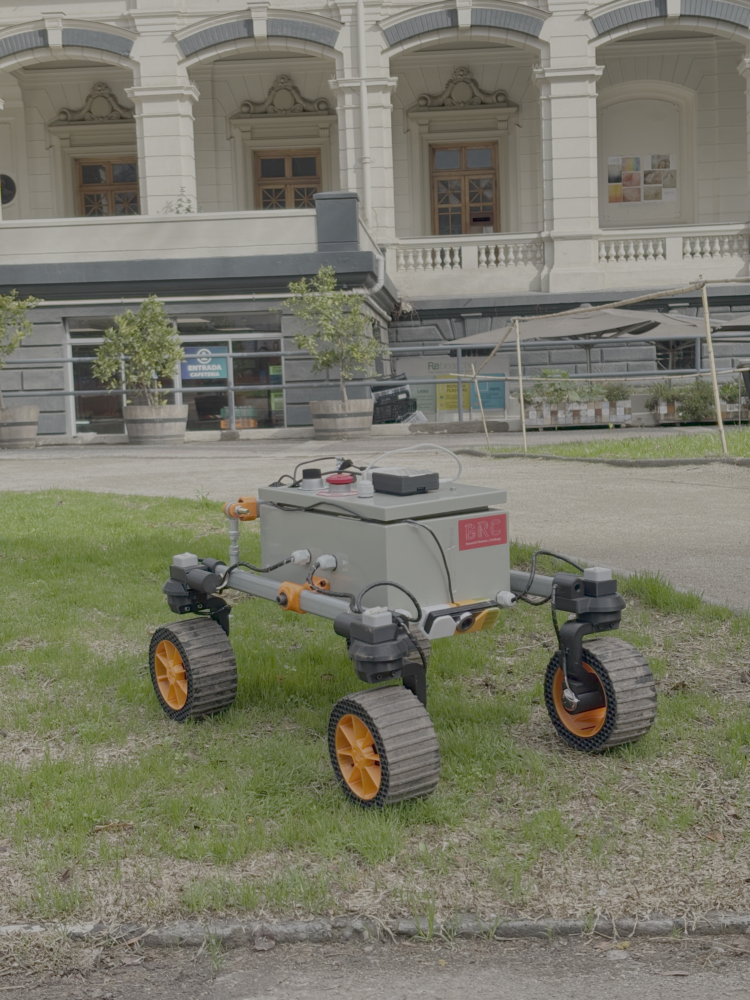

# H.E.R.MES Rover

HERMES (High-Mobility Exploration Rover) is a Wi-Fi-controlled robotic platform designed for multi-terrain navigation. It serves as a proof of concept for a competition-grade rover operating in Mars-analog environments.

<p align="center">
  
  <br>
  <sub><i>HERMES Rover.</i></sub>
</p>

## The Platform

A three-node system for remotely controlling a 4-wheel rover via an Xbox gamepad. An Xbox controller on a PC sends control packets over UDP to a Raspberry Pi, which forwards them over USB serial to an RP2040 (Pico) that drives the motors and steers the wheels with closed-loop PID control. The Pico streams telemetry (steering angles and traction PWM duty) back to the PC via the same path in reverse.


<p align="center">
  
  <br>
  <sub><i>Rover movements.</i></sub>
</p>

## Video-feedback teleoperation

To provide real-time video feedback, the rover is equipped with a front-mounted camera. It streams low-latency video over WebRTC to a command center (e.g., a PC) connected to the rover's local Wi-Fi network.

<p align="center">
  
  <br>
  <sub><i>FPV teleoperation demo.</i></sub>
</p>

## Architecture

```
[Xbox Controller]
       |
  SDL2 polling (50 Hz)
       |
  [PC — hermes-pc]  ←─── UDP :5006 (FeedbackPacket) ───┐
       |                                                  │
   UDP :5005 (ControlPacket)                              │
       |                                                  │
  [Raspberry Pi — hermes-pi] ──────────────────────────┘
       ↕
  USB-CDC 115200 8N1
       ↕
  [RP2040 Pico — hermes-pico]
       |
  PWM H-bridges + AS5600 encoders
       |
  [4x Traction motors + 4x Steering motors]
```

## Repository Layout

| Folder   | Description |
|----------|-------------|
| `common/` | Shared protocol header — `ControlPacket` (16 B) and `FeedbackPacket` (35 B) |
| `pc/`     | C++17 SDL2 client — reads gamepad, sends control, receives telemetry |
| `pi/`     | C++17 POSIX bridge — relays packets in both directions |
| `pico/`   | Arduino/PlatformIO firmware — packet parsing, Ackermann steering, PID servo, feedback |

## Prerequisites

| Component | Requirements |
|-----------|-------------|
| `pc`   | SDL2, CMake ≥ 3.16, C++17 compiler |
| `pi`   | CMake ≥ 3.16, C++17 compiler (no extra libs — POSIX only) |
| `pico` | PlatformIO, `raspberrypi` + `arduino` platform |

## Quick Start

**1. Flash the Pico**
```sh
cd pico
pio run --target upload
```

**2. Build and run the Pi bridge**
```sh
cd pi
cmake -B build && cmake --build build
./build/hermes-pi /dev/ttyACM0 5005
```

**3. Build and run the PC client**
```sh
cd pc
cmake -B build && cmake --build build
./build/hermes-pc <pi-ip-address> 5005
```

Connect an Xbox-compatible controller before launching the PC client.

## Protocol

Two packet types are defined in `common/protocol.hpp`, both using XOR checksums and sequence counters:

| Packet | Size | Magic | Direction | Port |
|--------|------|-------|-----------|------|
| `ControlPacket` | 16 B | `0xAB` | PC → Pi → Pico | UDP `:5005` / serial |
| `FeedbackPacket` | 35 B | `0xCD` | Pico → Pi → PC | serial / UDP `:5006` |

See [`common/README.md`](common/README.md) for the full field layouts.
